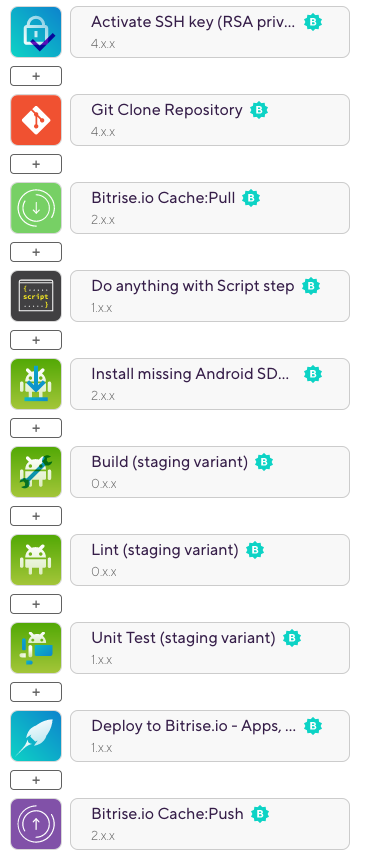
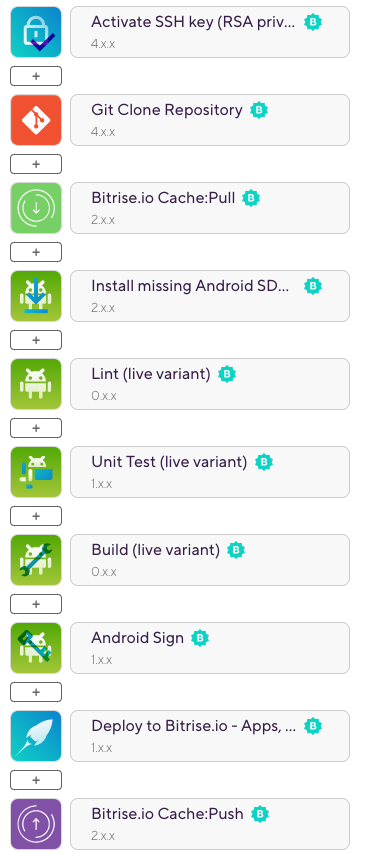

# Bitrise Android Product Flavor Sample

[](https://app.bitrise.io/app/e6acd6634ef188c0)

This is a sample Android project that demonstrates a [Bitrise](https://bitrise.io) CI/CD setup with multiple product flavors. Build history is publicly available [here](https://app.bitrise.io/app/e6acd6634ef188c0#/builds).

## Project setup and config

There are two product flavors defined in `build.gradle`:

```groovy
flavorDimensions "backend"

productFlavors {
    staging {
        dimension "backend"
    }
    live {
        dimension "backend"
    }
}
```

In a real-world project, the two endpoints would connect to two different API endpoints, so developers can use a staging build to test features without affecting production data.

### Bitrise Workflow

#### `primary` Workflow

<details>
<summary>Workflow Steps</summary>


</details>

This Workflow is automatically run by Bitrise on every commit on every branch. __This builds and tests the `staging` flavor of the app.__

#### `deploy` Workflow
<details>
<summary>Workflow steps</summary>


</details>

This Workflow builds a release app __using the `live` flavor__ and signs it with the release signing config (signing key and passwords are stored as secrets on Bitrise). The signing is done by the **[Android Sign]**(https://www.bitrise.io/integrations/steps/sign-apk) Step, so there is no signing configuration defined in `build.gradle`.

You can run this Workflow manually on Bitrise or you can set up an automatic trigger. Additionally, you can [configure auto-incrementing version numbers with an extra step](https://devcenter.bitrise.io/builds/build-numbering-and-app-versioning/).

## Advanced use cases

While this repo demonstrates a simple project config on Bitrise, there are many advanced features that might be relevant for your project:

- [Generating multiple APKs (multi-flavor) in one workflow](https://devcenter.bitrise.io/deploy/android-deploy/generate-and-deploy-multiple-flavor-apks-in-a-single-workflow/)
- [Exporting a universal APK from an AAB](https://devcenter.bitrise.io/deploy/android-deploy/exporting-a-universal-apk-from-an-aab/)
- [Running tests in Visual Studio App Center](https://devcenter.bitrise.io/testing/run-your-tests-in-the-app-center/)
- [Measuring your code coverage with Codecov](https://devcenter.bitrise.io/testing/measuring-your-code-coverage-with-codecov/)
